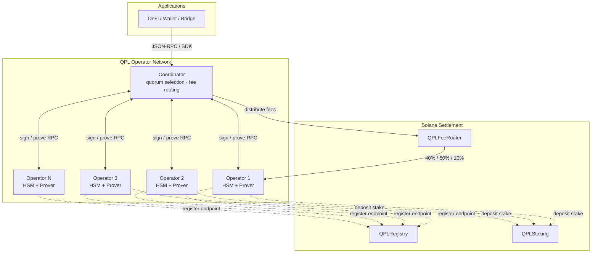
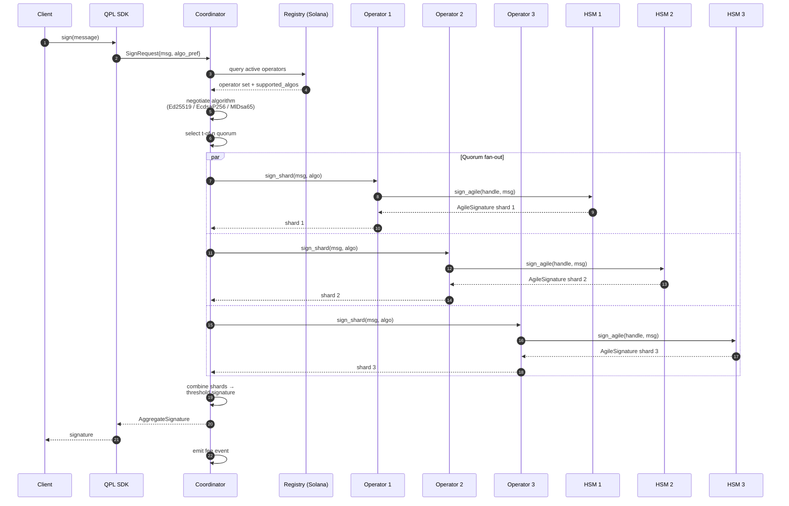
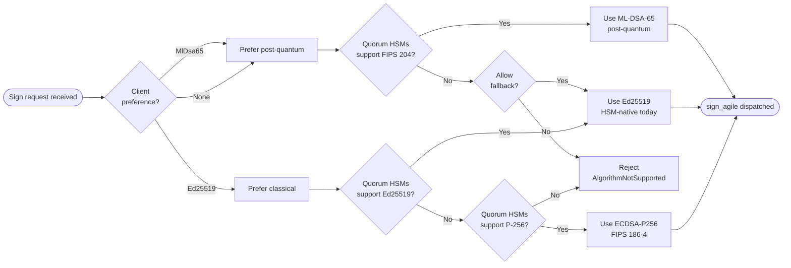
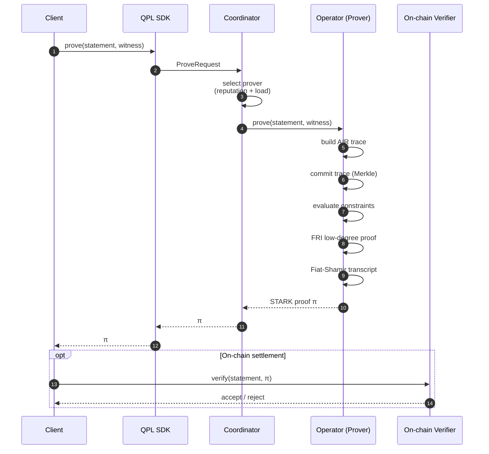
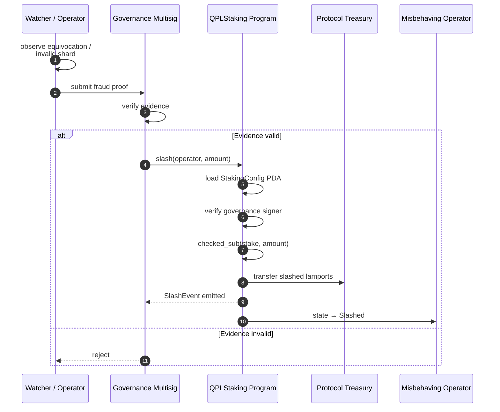
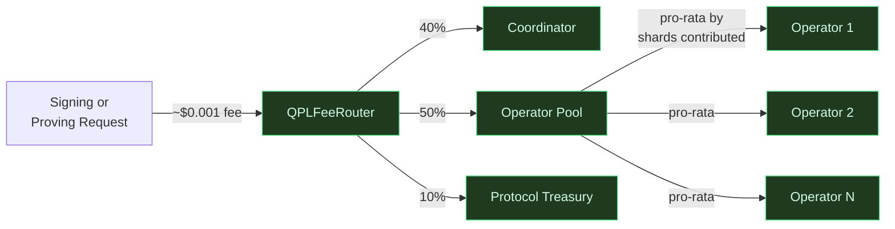
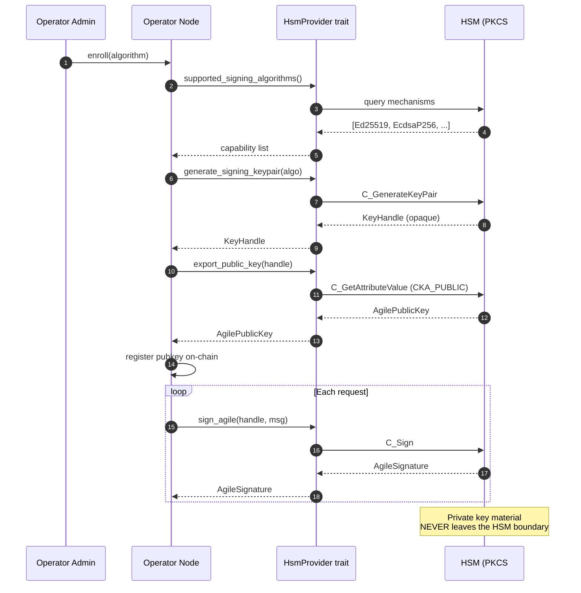
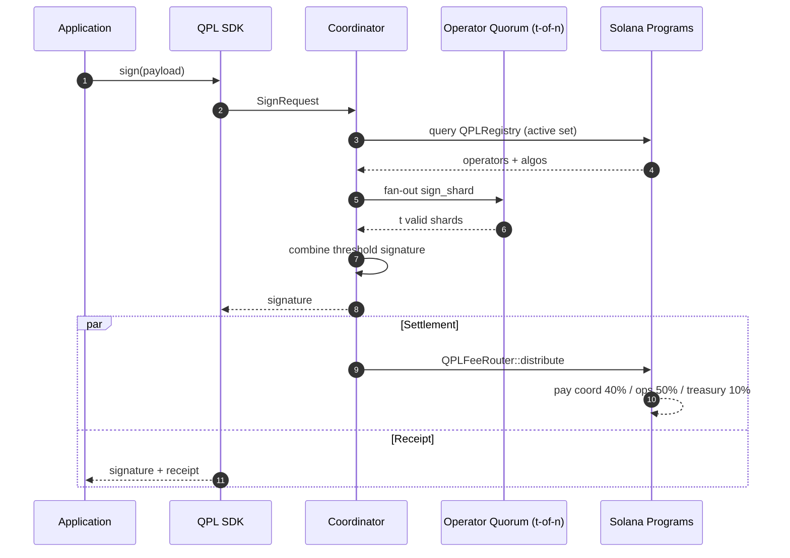
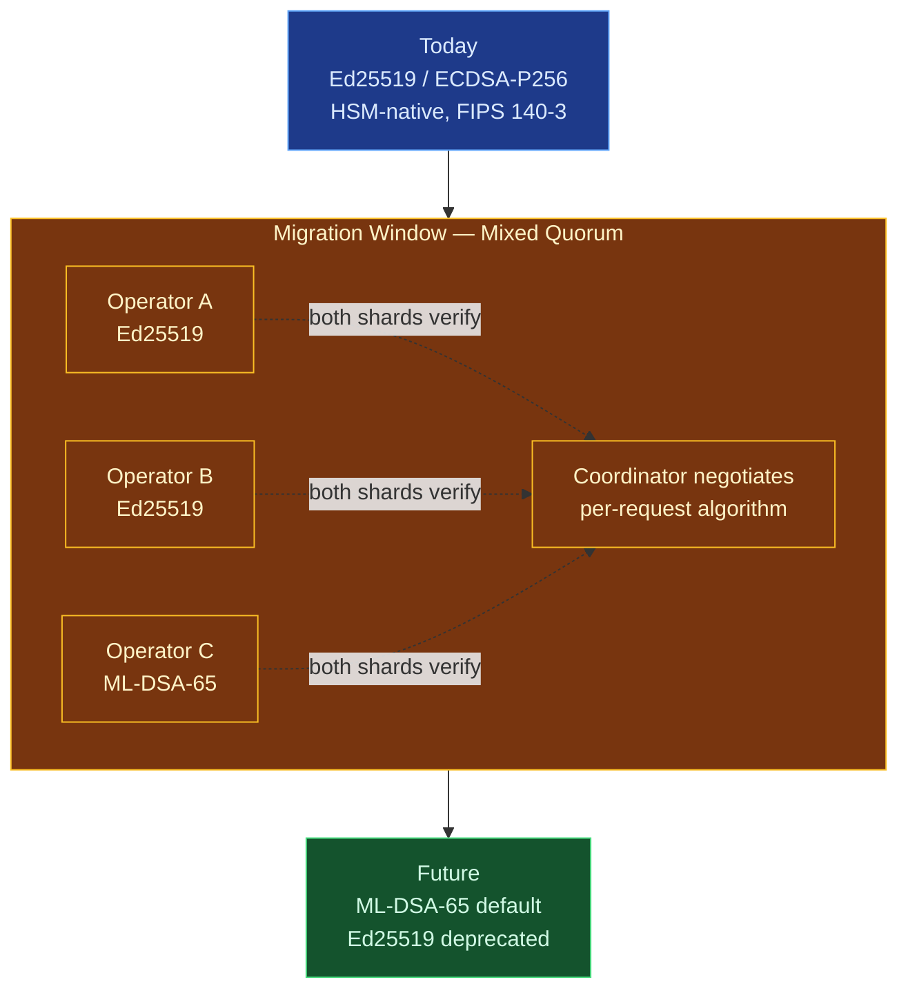

# QPL Protocol Flows

Mermaid diagrams illustrating the core protocol flows of the QPL Network.

---

## 1. System Architecture

End-to-end view of how applications, operators, and the Solana settlement layer interact.



---

## 2. Threshold Signing Flow (with Algorithmic Agility)

A single signing request, fanned out to a `t-of-n` quorum, with each operator using its HSM-resident key.



---

## 3. Algorithmic Agility — Algorithm Selection

How an operator advertises capability and how the coordinator picks the strongest mutually-supported algorithm.



---

## 4. STARK Proving Flow

Proof generation for an arbitrary statement (e.g. a rollup batch or off-chain compute).



---

## 5. Operator Lifecycle (Staking State Machine)

```mermaid
stateDiagram-v2
    [*] --> Unregistered

    Unregistered --> Staked: deposit ≥ 10 SOL<br/>QPLStaking::stake
    Staked --> Joined: register endpoint<br/>QPLRegistry::join
    Joined --> Active: heartbeat OK<br/>quorum eligible
    Active --> Active: serve sign / prove<br/>earn fees

    Active --> Draining: request_exit
    Draining --> Exited: 7-day cooldown<br/>QPLStaking::withdraw
    Exited --> [*]

    Active --> Slashed: misbehavior detected<br/>QPLStaking::slash
    Draining --> Slashed: misbehavior detected
    Slashed --> Exited: residual stake returned

    note right of Slashed
        Slashable offenses:
        • equivocation
        • invalid signature shard
        • invalid proof
        • liveness failure
    end note
```

---

## 6. Slashing Flow

End-to-end path from misbehavior detection to on-chain stake reduction.



---

## 7. Fee Routing Flow

How a single operation fee is split among coordinator, operators, and treasury.



---

## 8. Key Lifecycle Inside an Operator HSM

What happens to a signing key from generation to use — the key never leaves the HSM.



---

## 9. End-to-End Request: SDK → Operator → Solana

A full happy-path trace combining signing, settlement, and fee distribution.



---

## 10. Post-Quantum Migration Path

How operators transition from Ed25519 today to ML-DSA-65 when FIPS 204 firmware ships, with zero protocol downtime.



---

## Rendering

These diagrams render natively on:

- GitHub / GitLab (Markdown)
- VS Code with the Markdown Preview Mermaid extension
- mermaid.live (paste any block to edit interactively)
